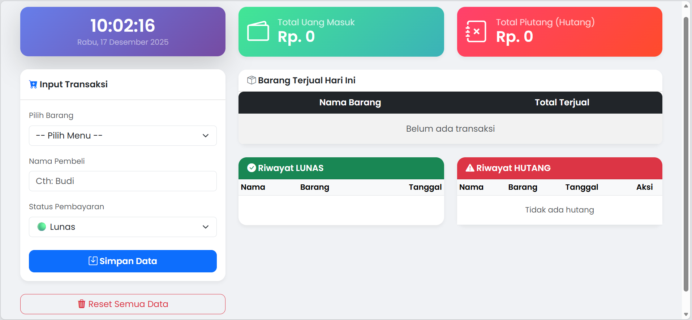

# Aplikasi Kasir Sederhana

Aplikasi Kasir berbasis Web menggunakan PHP Native dan Database MySQL.
Dibuat untuk memenuhi tugas mata kuliah Pemrograman lanjutan.

## Fitur
1. Input transaksi penjualan.
2. Pilihan pembayaran (Lunas / Hutang).
3. Dashboard pemasukan & piutang.
4. Riwayat transaksi real-time.
5. Fitur pelunasan hutang (Update Status).
6. Reset data transaksi.

## Cara Instalasi (Untuk Dosen/Pengguna)
1. Download source code ini (Klik tombol Code > Download ZIP).
2. Ekstrak folder ke `C:\xampp\htdocs\kasir`.
3. Nyalakan XAMPP (Apache & MySQL).
4. Buka browser: `localhost/phpmyadmin`.
5. Buat database baru dengan nama: `db_kasir`.
6. Klik menu **Import**, lalu pilih file `db_kasir.sql` yang ada di dalam folder proyek ini.
7. Jalankan aplikasi di browser: `localhost/kasir`.

## Teknologi
- PHP Native
- MySQL (MariaDB)
- Bootstrap 5 (CSS Framework)
- SweetAlert2 (Notifikasi)
