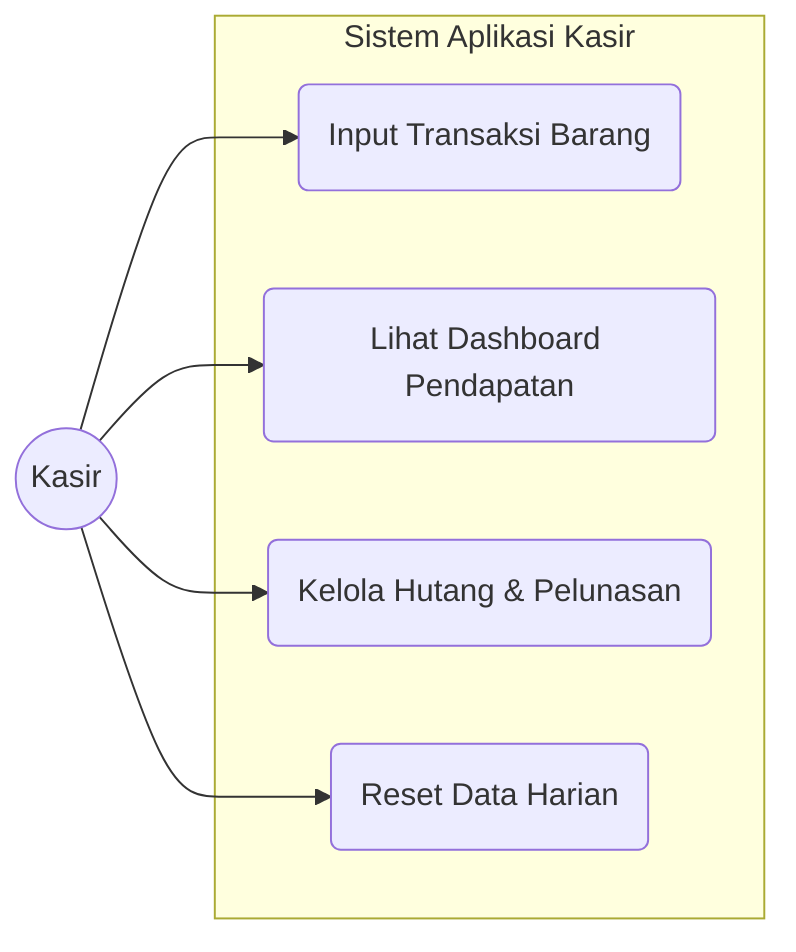
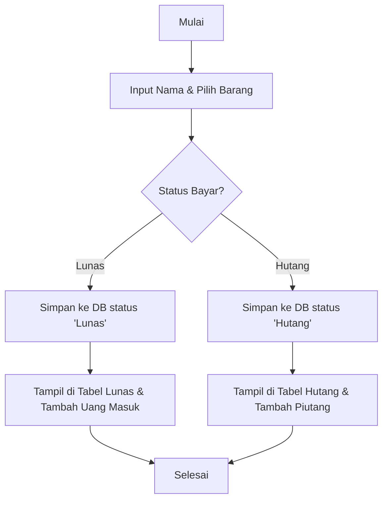
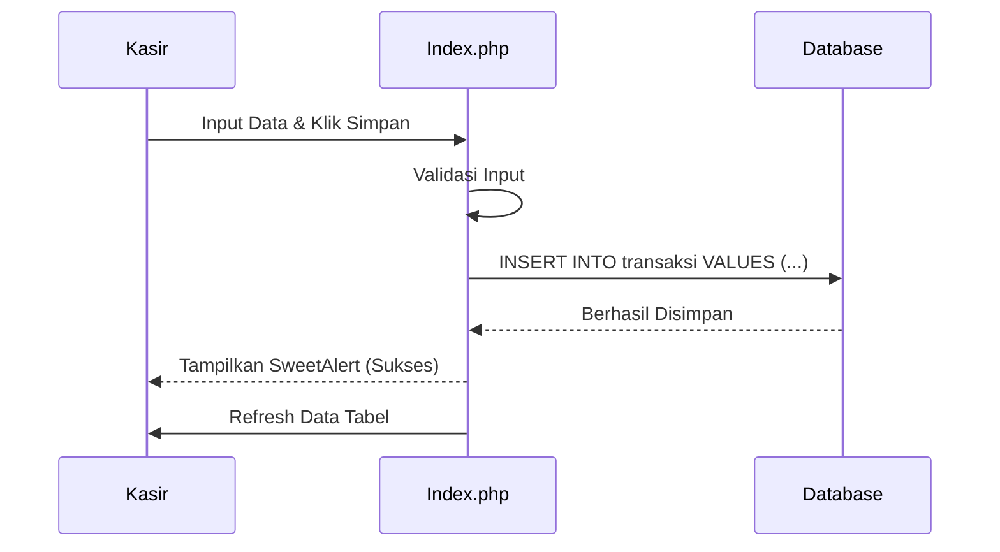

# Aplikasi Kasir Sederhana

## 1. Deskripsi Project
Aplikasi Kasir Sederhana adalah sistem berbasis web yang dirancang untuk membantu pencatatan transaksi penjualan pada kantin atau toko kelontong skala kecil. Sistem ini mengatasi masalah pencatatan manual dengan menyediakan fitur input pesanan yang cepat, pemantauan status pembayaran (Lunas vs Hutang), serta rekapitulasi pendapatan harian secara *real-time*.

## 2. User Story
Sebagai pengguna utama aplikasi (Kasir), berikut adalah kebutuhan interaksinya:
* **Sebagai Kasir**, saya ingin mencatat nama pembeli dan barang yang dibeli agar stok keluar tercatat.
* **Sebagai Kasir**, saya ingin memilih status pembayaran "Hutang" atau "Lunas" untuk membedakan uang yang sudah diterima dan yang belum.
* **Sebagai Kasir**, saya ingin melihat dashboard total uang masuk dan total piutang agar tahu pendapatan hari ini.
* **Sebagai Kasir**, saya ingin menekan tombol "Lunasi" pada daftar hutang ketika pembeli membayar tagihannya.
* **Sebagai Kasir**, saya ingin mereset semua data transaksi di akhir hari untuk memulai pembukuan baru besok.

## 3. SRS (Software Requirements Specification)

### Feature List (Fungsional):
1.  **Input Transaksi:** Form untuk memasukkan nama pembeli, memilih jenis barang (dengan harga otomatis), dan status bayar.
2.  **Dashboard Monitoring:** Widget informasi yang menampilkan total nominal "Uang Masuk" dan "Total Piutang" secara otomatis.
3.  **Rekap Barang:** Tabel yang mengelompokkan jumlah barang yang terjual (misal: Roti terjual 5 pcs).
4.  **Manajemen Hutang:** Fitur untuk mengubah status transaksi dari "Hutang" menjadi "Lunas" (Update Database).
5.  **Riwayat Transaksi:** Menampilkan log pembeli berdasarkan waktu/tanggal, dipisah antara tabel Lunas dan Hutang.
6.  **Reset Data:** Fitur keamanan untuk menghapus seluruh riwayat transaksi (Truncate) dengan konfirmasi peringatan.

## 4. UML (Unified Modeling Language)

Berikut adalah diagram alur logika aplikasi ini:

### A. Use Case Diagram

### B. Activity Diagram (Alur Transaksi)

### C. Sequence Diagram (Proses Input)

## 5. Mock-Up / Antarmuka
Berikut adalah tampilan antarmuka aplikasi yang sudah jadi:


Desain antarmuka pengguna (UI) dirancang dengan prinsip **Clean & Minimalist**:
* **Layout:** Terbagi menjadi dua kolom utama (Kiri: Input & Kontrol, Kanan: Informasi & Data).
* **Color Coding:** Menggunakan warna **Hijau** untuk lunas dan **Merah** untuk hutang.

## 6. SDLC (Software Development Life Cycle)
Metode pengembangan yang digunakan dalam proyek ini adalah **Waterfall Model**:

1.  **Requirement Analysis (Analisis Kebutuhan)**
    Mengidentifikasi masalah pencatatan manual dan menentukan kebutuhan utama sistem, yaitu pencatatan transaksi cepat dan manajemen hutang piutang.

2.  **System Design (Perancangan Sistem)**
    Merancang skema database MySQL (tabel `transaksi`) dan merancang antarmuka pengguna (User Interface) menggunakan framework Bootstrap 5.

3.  **Implementation (Implementasi Kode)**
    Tahap penulisan kode program (*Coding*) menggunakan bahasa pemrograman PHP Native untuk *backend* dan HTML/CSS/JS untuk *frontend*.

4.  **Testing (Pengujian)**
    Melakukan pengujian fungsional (*Black Box Testing*) untuk memastikan fitur input data, perhitungan otomatis dashboard, dan fitur reset berjalan sesuai logika.

5.  **Maintenance (Pemeliharaan)**
    Tahap perbaikan *bug* minor dan penyempurnaan tampilan antarmuka agar lebih *user-friendly*.

---
### Cara Instalasi (Panduan Penggunaan)

Untuk menjalankan aplikasi ini di komputer lokal (localhost), ikuti langkah-langkah berikut:

1.  **Persiapan Lingkungan (Environment)**
    * Pastikan aplikasi **XAMPP** sudah terinstall.
    * Jalankan modul **Apache** dan **MySQL** pada control panel XAMPP.

2.  **Download Source Code**
    * Download repository ini (klik tombol Code > Download ZIP).
    * Ekstrak folder tersebut ke dalam direktori `C:\xampp\htdocs`.
    * Ubah nama foldernya menjadi `kasir` (agar mudah diakses).

3.  **Setup Database**
    * Buka browser dan akses `http://localhost/phpmyadmin`.
    * Buat database baru dengan nama **`db_kasir`**.
    * Klik tab **Import**, lalu pilih file `db_kasir.sql` yang ada di dalam folder proyek ini.
    * Klik tombol **Go/Kirim** untuk memproses import.

4.  **Konfigurasi Koneksi (Opsional)**
    * Buka file `koneksi.php`.
    * Pastikan pengaturan berikut sesuai dengan settingan XAMPP Anda:
        ```php
        $host = "localhost";
        $user = "root";
        $pass = ""; // Kosongkan password default XAMPP
        $db   = "db_kasir";
        ```

5.  **Jalankan Aplikasi**
    * Buka browser dan ketik alamat: `http://localhost/kasir`.
    * Aplikasi siap digunakan.
